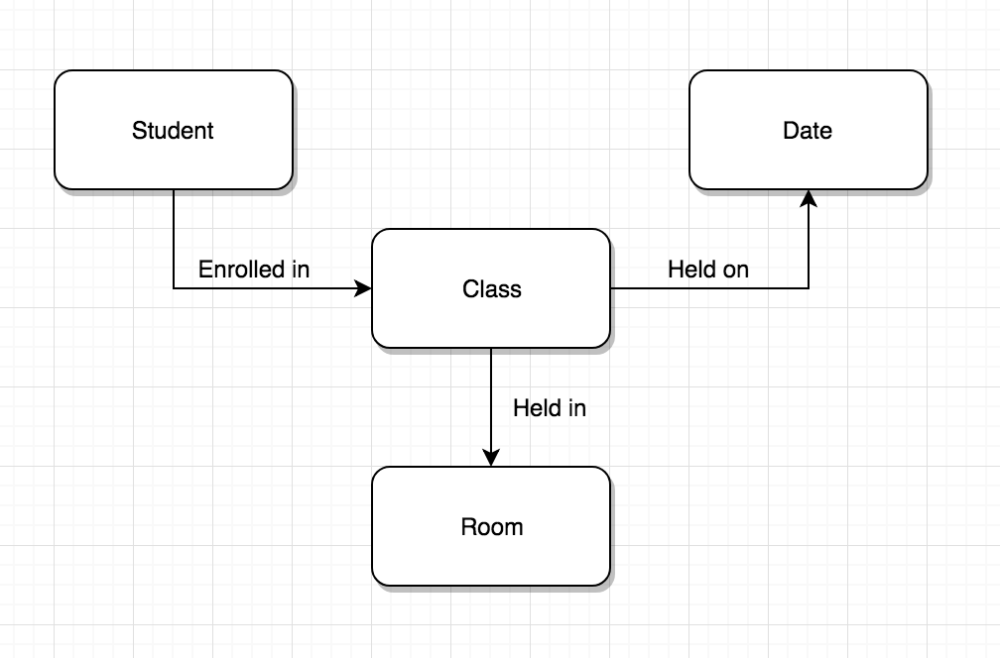

# How to start and run

* start by having swi-prolog installed and working, this can be tested by writing `swipl`
* when you have it working and the file is downloaded use the `pwd` to load the script.

run this command
`consult('path/to/myfile.pl').`

